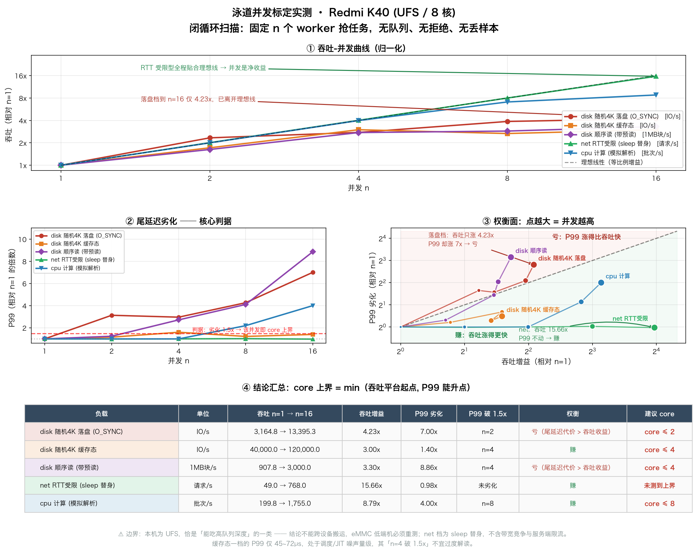

# 线程治理方案 · 工程实现

配套笔记：[../线程治理/线程滥用与治理.md](../线程治理/线程滥用与治理.md)

本目录是那套四层防线的**可运行实现**，四条防线都在 API 36 模拟器上实测通过。

---

## 目录结构

```
app/src/main/java/com/interview/thread/
├── ThreadPools.kt              第1步 规范层：治理入口 + 四条隔离泳道 + 命名工厂
├── LaneCalibration.kt          第1步 标定：闭循环并发扫描，把「保守起点」换成实测拐点
├── ThreadMisuseScenarios.kt    第1步 对照：故意复现的 4 种线程失控劣习
├── ThreadMonitor.kt            第2步 监控层：线程快照 / 命名率 / 前缀聚类
├── NativeThreadHook.kt         第4步 Native：Hook 的 Java 侧入口
├── ThreadDefense.kt            第4步 兜底：栈压缩 + 限流降级
├── UnifiedThread.kt            第3步 收敛层：ASM 替换的目标类
├── ThreadGovernanceActivity.kt Demo 宿主（所有验证入口）
└── ../../../../../cpp/thread_hook.cpp   第4步 Native：GOT Hook 实现

build-logic/thread-plugin/       第2/3步 ASM Gradle 插件（独立构建）
├── ThreadMonitorPlugin.kt       插件入口
├── ThreadAsmVisitorFactory.kt   AGP AsmClassVisitorFactory 接入
├── ThreadClassVisitor.kt        指令级变换核心
└── ThreadMonitorExtension.kt    配置项

thread-lint/                     第1步 规范层门禁：自定义 Lint 规则
├── ThreadMisuseDetector.kt      拦 new Thread / Executors.newXxx / HandlerThread
├── ThreadLintIssueRegistry.kt   IssueRegistry（SPI 注册）
└── src/test/…                   11 个用例，反例比正例多（误报控制）

.github/workflows/
└── thread-governance.yml        CI 卡口：规则单测 + 聚焦 lint 闸门
```

---

## 实测结果（API 36 模拟器）

| 防线 | 验证方式 | 结果 |
|---|---|---|
| 第1步 规范层 | 打印各池配置 | ✅ 5 个统一池就绪，命名工厂生效 |
| 第1步 对照 | 制造失控场景 | ✅ 裸Thread×10 / 未关池×5 / 多SDK池×4 / HandlerThread×5 |
| 第2步 监控 | 线程快照 | ✅ 45 个线程，按前缀聚类，堆栈可追到调用点 |
| 第2步 命名率 | 对照实验 | ✅ 统一池 `app-bg-N` 可溯源；默认工厂 `pool-5-thread-M` 不可溯源（20.0%）|
| 第3步 收敛 | 开启 enableUnify | ✅ **线程总数 45 → 24，业务线程 29 → 8** |
| 第4步 Native | GOT Hook libart.so | ✅ 累计捕获 **139 次**线程创建 |
| 第4步 栈压缩 | 50 个线程对照 | ✅ 默认栈与 256KB 栈均创建成功（64 位未撞 OOM，符合预期）|
| 第4步 限流 | 提交 30 个任务 | ✅ 拒绝 22 个，活跃数守住上限 8 |
| **泳道隔离** | 4×800ms 慢任务 + 1×20ms 快任务 | ✅ **快任务等待 839ms → 3ms** |

**最硬的一条证据 —— 泳道隔离对照**（`1.泳道隔离对照` 按钮实测输出）：

```
场景：先提交 4 个 800ms 的磁盘任务，再提交 1 个 20ms 网络任务

A. 单一 IO 池（core=4 max=16 无界队列）
   网络任务等待 = 839ms  ← 被 4 个慢任务堵住
   注：max=16 不会救场，无界队列使扩容条件永不成立

B. 泳道隔离（disk 泳道跑慢任务，net 泳道跑网络任务）
   网络任务等待 = 3ms    ← 网络泳道空闲，立即执行

结论：并发上限相同（4 vs 4），但泳道把「无关任务互相拖累」消灭了。
```

实测指标（`1.统一池` 按钮）：

```
net    core=4 max=8 实际=1 队列=0/8    提交=1 拒绝(队列/配额)=0/0 waitP99=1ms
disk   core=2 max=4 实际=2 队列=0/4    提交=4 拒绝(队列/配额)=0/0 waitP99=808ms
db     core=1 max=1 实际=0 队列=0/16   提交=0 拒绝(队列/配额)=0/0 waitP99=0ms
bg     core=1 max=2 实际=0 队列=0/32   提交=0 拒绝(队列/配额)=0/0 waitP99=0ms
legacy-io core=4 max=16 实际=4 队列=无界 提交=5 waitP99=838ms   ← 反面教材
```

`waitP99` 直接量化了问题：`disk=808ms`（被自己的慢任务排队）vs `net=1ms`（无阻塞）。


**ASM 插桩的字节码证据**（`javap` 反汇编实际产物）：

```java
// 插桩前
21: invokespecial  java/lang/Thread."<init>":(Ljava/lang/Runnable;)V

// 插桩后（变换 A：命名）
21: ldc_w          "com.interview.thread.ThreadMisuseScenarios"
24: invokespecial  java/lang/Thread."<init>":(Ljava/lang/Runnable;Ljava/lang/String;)V

// 插桩后（变换 B：收敛，NEW 与 <init> 同步改写）
12: new            com/interview/thread/UnifiedThread
24: invokespecial  com/interview/thread/UnifiedThread."<init>":(Ljava/lang/Runnable;Ljava/lang/String;)V
```

---

## 泳道设计：为什么不是「全 App 一个 IO 池」

第一版实现是单一 IO 池，重构为「**一个治理入口 + 四条隔离泳道**」。理由是单一池有三处硬伤：

1. **队头阻塞**：`LinkedBlockingQueue` 是 FIFO，前面堵 4 个 30s 的文件扫描，
   后面所有 50ms 的配置请求一起等 30s（实测 839ms vs 3ms 就是这个）。
2. **下游资源异构**：网络受带宽与 RTT 约束、磁盘受尾延迟（写放大/GC）约束、
   SQLite 是单写者。用一个并发数服务三种资源，对每种都是错的。
3. **全局故障面**：一个 SDK 失控提交慢任务，全 App 的 IO 一起瘫痪 ——
   等于在另一个层面重建了「线程滥用」本身。

**治理能力（命名/配额/监控）收在入口层，执行能力按下游资源分道。**
「收口」收的是治理，不是物理池。

### 泳道大小的依据

**不是**服务器公式 `核数 × (1 + W/C)` —— 那是追求 CPU 利用率最大化的算法，
移动端的目标函数是「延迟 + 功耗」，故意不这么算。

定值问题不是「最多能开多少」，而是：

> 在**排队延迟（P99）不劣化**的前提下，让下游资源恰好跑满的**最小**并发。

#### 依据要分级，别把三样东西混为一谈

| 依据 | 等级 | 说明 |
|---|---|---|
| RTT 受限的小请求：n=1→4 有显著线性收益 | **硬（可推导 + 已实测）** | 实测 n=1→16 达 15.66x 完美线性，P99 恒定 |
| 带宽受限的大传输：并发超 ~2-3 不再增吞吐 | **硬（可推导）** | 只给出**上界**，给不出定值 |
| 射频 tail：收益来自**批次数**减少 | **硬（有文献）** | 支持 batching，不直接支持「并发=4」 |
| OkHttp `maxRequestsPerHost=5` | **惯例** | 且是 **per-host**，非全局 |
| eMMC 4.4/4.5 无有效并行提交 | **硬（前提成立）** | — |
| ~~「UFS 队列深度低」~~ | **❌ 已实测证伪** | 落盘档吞吐 n=1→16 涨 4.23x，明显吃并发 |
| 元数据锁 / 写放大恶化 P99 | **硬（已实测）** | 落盘档 P99：403µs → 2822µs（7x）→ 这才是 disk 限流的真理由 |
| `core=4/2`、`max=8/4` 具体取值 | **实测（本机）见下** | disk 实测 core ≤ 2、cpu ≤ 8；**net 的上界不来自本地曲线** |

#### 逐条说明

**`net` = 4 / 8**

1. **RTT 受限型是净收益，不是「均分」**。吞吐 `λ = n / (RTT + S/B)`，W 几乎不随 n
   变化 → n=1→4 接近**线性**。一个 100ms RTT 的接口，4 并发把 4 次串行的 400ms
   压到 ~100ms。
2. 「加并发只是均分带宽」**只对带宽受限的大文件传输成立** —— 那里
   `λ = B/S` 与 n 无关。所以这条给的是**上界**，给不出 4 这个值。
3. 真正把上界压在 4 附近的是：**per-host 连接池**（OkHttp 默认
   `maxIdleConnections=5`，HTTP/1.1 下超出连接数的请求只能串行）、
   **服务端风控**（单 host 并发过高会被 CDN/WAF 判异常）、每线程栈开销。
4. **射频 race-to-sleep**：传输结束后射频不立刻回 IDLE，RRC inactivity 的 tail
   是**秒级**高功耗窗口。但 tail 的**次数**取决于「请求间隔 vs timer」，
   **不取决于并行度** —— 并行只是把窗口从 `Σw` 缩到 `max(w)`。真正治 tail 的是
   **batching**（攒起来一次打完，见 TailEnder / TOP），不是加并发。

⚠️ **泳道并发 4 ≠ 网络并发 4。** `net` 泳道的 4 个线程把请求交给 OkHttp，
OkHttp 自己还有 `Dispatcher`（`maxRequests=64 / maxRequestsPerHost=5`）与连接池。
两层是**叠乘**关系，不是同一层。

**`disk` = 2 / 4 —— 旧注释的物理前提是错的**

原文写「手机 UFS/eMMC 随机 IO 队列深度低」，把两种**相反**的形态并列了：

| 介质 | 并行提交能力 |
|---|---|
| eMMC 4.4/4.5 | **单命令队列**，主机侧无真正并行提交 → 依据成立 |
| eMMC 5.1+ | 引入 CQ（队列深 32），但入门机实现普遍很浅 |
| **UFS** | SCSI-derived CQ，**理论队列深 32** → **依据不成立** |

实测已证伪：本机（UFS）随机写吞吐从 n=1 到 n=16 **涨了 4.23x**，
到 n=16 仍未趋平 —— 它确实吃并发。

**那 `disk=2` 还站得住吗？站得住，但理由在软件栈与尾延迟**（也是实测结论）：

- 吞吐还能涨，但 **P99 在 n=2 就已劣化 3.1x**，n=16 时劣化 **7x**（403µs → 2822µs）
- 机制是随机**写**推高闪存 GC 与写放大，**P99 恶化远快于 P50**
- 另有文件系统元数据路径（`open/stat/readdir` 在 dentry/inode 锁上串行），这部分
  与块层并行度无关
- 所以 disk 限流的首要目的是**保尾延迟**，与 net 同源

#### ⚠️ `max` 与 `queueCapacity` 的关系（本轮修正）

`ThreadPoolExecutor` 的语义是「**先填 core → 再入队 → 队列满才扩到 max**」。
旧配置 `queueCapacity=32` 时，`net` 要扩到 8 需已在途 **4+32=36** 个任务 ——
那时 `waitP99` 早已爆掉，**`max` 只在过载区生效**。

这与「修正 1：让扩容条件真正可达」**自相矛盾** —— 只是从「永不可达」变成
「可达但无意义」，是程度差别不是性质差别。

已把队列收窄到与 `max` 匹配：

| 泳道 | core/max | 队列（旧 → 新） |
|---|---|---|
| `net` | 4 / 8 | 32 → **8** |
| `disk` | 2 / 4 | 16 → **4** |
| `db` | 1 / 1 | 64 → **16** |
| `bg` | 1 / 2 | 128 → **32** |

语义变成「**稳态 core，超载借 max 并更早背压**」。

---

## 泳道并发标定：把「保守起点」换成实测拐点

`1.并发扫描标定` 按钮（`LaneCalibration.kt`）。测量模型是**闭循环**：
固定 n 个 worker 抢共享任务计数，没有队列、没有拒绝、没有丢样本，
并发严格等于 n，墙钟即真实耗时。



> 图表由 `tools/plot_lane_calibration.py` 从实测数据生成，可重跑。

> ⚠️ 第一版用「一次性提交 48 个任务给 `SynchronousQueue` 池」，结果 n=1 那档
> 完成 1 个、拒绝 47 个 —— 测出来的「吞吐」其实在数拒绝数，全是废数据。
> 开循环提交 + 无缓冲队列是错的设计，**已改为闭循环**（fio/wrk 的固定并发模式同理）。

### 实测结果（M2012K11AC / alioth / Android 12 / 8 核 / **UFS**）

**① 随机 4K + `force(true)` 落盘 —— flash 的真实行为**

| n | 吞吐(IO/s) | 相对 1x | P50(µs) | P99(µs) |
|---|---|---|---|---|
| 1 | 3164.8 | 1.00x | 277 | 403 |
| 2 | 7384.6 | 2.33x | 239 | **1262（3.1x）** |
| 4 | 8727.3 | 2.76x | 381 | 1193 |
| 8 | 12255.3 | 3.87x | 548 | 1719 |
| 16 | 13395.3 | **4.23x** | 1092（4x） | **2822（7x）** |

**判读**：吞吐到 n=16 仍在涨（**UFS 确实吃队列深度**，证伪旧依据），
但 P99 从 n=2 就崩 → **core ≤ 2**。两个结论同时成立，互不矛盾：
**吞吐能涨 ≠ 该涨**，限流的目的是保尾延迟。

**② 随机 4K 读写（缓存态）** —— `n=1 时 P50 仅 17µs`，说明读全在 page cache 里，
这一档测的是**软件栈**：吞吐 n=4 后基本走平（3.00x → 3.00x）→ core ≤ 4。

**③ 顺序读（带预读）** —— 吞吐 n=4 后趋平（2.75x → 3.30x），P99 从 n=4 起劣化 2.7x
→ core ≤ 4。**注意它给出的建议值（4）比随机写（2）高一倍**，这正是
「顺序读会给出假高拐点」的实证 —— 标定必须用随机写混合负载。

**④ net RTT 受限（sleep 替身）** —— n=1→16 吞吐 **15.66x，完美线性**，
P99 恒定 20ms。**证实「RTT 受限型任务并发是净收益」**（与「均分带宽」无关）。
⚠️ 这是 sleep 替身，不含带宽竞争与服务端限流；真实 net 泳道必须弱网实测 ——
它的 W 本身依赖 n，是自反馈系统，**无静态解**。

**⑤ cpu 计算** —— n≤4 线性（3.98x），n=8 时 P99 从 5.0ms → 11.0ms（2.2x），
n=16 → 20ms（4x）→ core ≤ 8。拐点与 8 核器件吻合。

### 判读方法：看「权衡面」而不是看吞吐

核心不是「吞吐涨到哪停」，而是 **吞吐增益 vs P99 劣化** 谁涨得快
（图③的对角线判据）：

| 档位 | 状态 |
|---|---|
| 点在对角线**下方** | 吞吐涨得比 P99 快 → **赚**（net、cpu） |
| 点在对角线**上方** | P99 涨得比吞吐快 → **亏**（落盘档、顺序读） |

取两条线中**较小者**作为 core 上界：

- **吞吐平台起点** —— 再加并发换不到吞吐（相邻档位增益 <15%）
- **P99 陡升点** —— 服务时间被争用推高（超过首档 1.5x）

本机实测结论：

| 泳道 | 建议 core | 依据 |
|---|---|---|
| `disk` | **2** | 落盘档 n=16 吞吐 4.23x，但 P99 7x（亏）；n=2 起已破 1.5x |
| `net` | 4（维持） | RTT 受限型 15.66x 线性、P99 恒定 —— 理论允许更高，但取值受 per-host 连接池与风控约束，非本地曲线所限 |
| `cpu` | **8** | 与核数吻合 |

> 实现上的诚实交代：`disk=2` 与实测的 `core ≤ 2` **结论一致**，但它是既有配置，
> 不是本轮实测改出来的 —— 请不要把它当作「测量驱动定值」的例证。
> 真正的测量价值在于**证伪了原依据**（见下）。

结果同时写入 logcat（`TAG: LaneCalib`）与
`Android/data/com.example.myapplication/files/LaneCalibration/calibration.csv`。

### 诚实边界

1. **page cache 兜底**：只有 `force(true)` 那档穿透了缓存，其余读路径是软件栈
   争用的**下界**。
2. **一根设备一个结论**：本机是 UFS，恰是「能吃高队列深度」的那类；
   换 **eMMC 低端机必须重测**（λ 与 W 会同时变差）。结论**不能跨设备搬运**。
3. **合成负载 ≠ 生产负载**：真实链路要按调用方采样重做。

> ⚠️ Little's Law 的 `L = λW` 给的是**稳态在途数**，**不能直接当并发配置** ——
> 你要的是满足 P99 的**最小 n**，这是必须实测的拐点问题。


### 三处对旧设计的修正

**修正 1：`maximumPoolSize` 从死配置变成生效。** 旧版 `LinkedBlockingQueue()`
容量是 `Integer.MAX_VALUE`，而 `execute()` 第 3 步要求「队列满才扩容」——
永不成立，实际并发上限恒为 core=4，写 16 是自欺。现在队列有界。

⚠️ 但**第一轮修正只做对了一半**：队列改成 32 后，扩容条件虽然可达，却要等到
在途 36 个任务才触发，`max` 仍困在过载区。**第二轮已把队列收窄到与 `max`
匹配：`net 8 / disk 4 / db 16 / bg 32`** —— 详见「泳道大小的依据」一节。

**修正 2：`CallerRunsPolicy` → `AbortPolicy`。** 旧注释写「降级为调用者线程执行，
避免 OOM」，但有两个问题：它对无界队列引发的堆积**无效**（那是真 OOM 来源），
而且泳道可以被**主线程**提交——饱和时让主线程去跑 IO 任务 = 直接 ANR。
现在改成 Abort，把背压显式抛回调用方（`execute` 返回 `false`），
由调用方决定丢弃/降级/上报。

**修正 3：优先级只用一条路径：`Process.setThreadPriority`。**

⚠️ 这一条我最初写错了，实测后更正 —— 原注释说「`Thread.setPriority` 效果弱、
不设置内核 nice」是**错的**。Android 实测映射（API 36）：

```
Thread.setPriority(1..10) → nice 19,16,13,10,0,-2,-4,-5,-6,-8
Process.THREAD_PRIORITY_BACKGROUND(10) → nice 10（即 java 4 的等价物）
```

`isAlive()==false` 时 Java 层确实不调 native（AOSP 源码如此），但 ART 在
`Thread.start()` → `Thread_nativeCreate` 时会拿 `java.lang.Thread.priority`
同步到内核。所以两条路径**落到的是同一个 nice**。

同时使用两者不是「双保险」，而是有害的：

- 语义重复，读者搞不清哪个生效
- `Thread.getPriority()` 会报出与内核不一致的数（走 Process 路径时仍是 5）
- **本项目实测到的真实 bug**：`bg` 泳道原本设了 `Thread.MIN_PRIORITY(1)`
  → ART 映射 nice=19，但随后 `run()` 里的 `setThreadPriority(BACKGROUND)`
  又把它覆盖成 nice=10，低优先级意图被静默丢失。修掉后实测 `app-bg-1 nice=19`。

选 `Process` 路径的理由：java 层够不到 niceness 极端区间 —— java 最低只到
**nice=-8**，而 `THREAD_PRIORITY_URGENT_AUDIO` 需要 **nice=-19**。

⚠️ 陷阱：`setThreadPriority` 作用于**当前线程**，写在 `newThread()` 里只会
改到创建者线程，必须包一层在新线程的 `run` 内设置。

配套知识：`setThreadPriority` 的正数常量（如 BACKGROUND=10）会让线程让出 CPU，
负数（如 URGENT_AUDIO=-19）提升优先级。**别在 ThreadFactory 里传超范围的值**，
内核会直接拒绝。


### 可观测性

`Lane.metrics()` 暴露 `queueDepth` / `waitP99Millis` / 拒绝计数。
**`queueDepth` 才是「任务是否堆积」的直接证据**，`poolSize` 看不出来；
`waitP99`（入队到开始执行的等待）比线程数更能反映真实压力。
另外每条泳道有 `quotaPerCaller`，挡住「一个模块吃满整条泳道」。

---

## 规范层的强制手段：自定义 Lint 规则

规范层（统一池收口）如果只写在文档里，就只是愿望。**code review 会漏、会疲劳、
会被人情放过；Lint 不会。** 所以「禁止裸用 `new Thread`」必须是一个可执行的门禁。

规则模块在 `thread-lint/`，挂在 `app` 的 `lintChecks` 上，随 `lintDebug` 执行。

### 拦的三类写法

| Issue ID | 拦截目标 |
|---|---|
| `NewThreadUsage` | `new Thread(...)`、`Thread(...)`、**自建 `Thread` 子类** |
| `ExecutorsThreadPool` | `Executors.newFixedThreadPool` / `newCachedThreadPool` / `newSingleThreadExecutor` / `newScheduledThreadPool` / `newSingleThreadScheduledExecutor` / `newWorkStealingPool` |
| `HandlerThreadUsage` | `android.os.HandlerThread` |

### 全链路（四步，缺一不可）

```
app/build.gradle.kts
  add("lintChecks", project(":thread-lint"))                    ← ① 挂载
        ↓
thread-lint/build.gradle
  compileOnly "com.android.tools.lint:lint-api:31.3.0"          ← ② 版本对齐 AGP
        ↓
src/main/resources/META-INF/services/
  com.android.tools.lint.client.api.IssueRegistry               ← ③ SPI 注册
        ↓
ThreadLintIssueRegistry : IssueRegistry                         ← ④ 暴露规则
        ↓
ThreadMisuseDetector : Detector(), SourceCodeScanner            ← ⑤ 实际扫描
```

⚠️ **第 ③ 步漏了会「静默失效」**：构建照样绿，什么都不报，你以为规则在跑。
这是本方案里最难查的失败模式。

**版本对齐规律：`lint = AGP major + 23`** —— AGP 8.3 → lint 31.3。
不对齐会 `NoSuchMethodError`。另注：`lint-api` 只在 `google()` 仓库有，
阿里云镜像取不到（实测 404）。

### 为什么用 UAST 而不是纯 PSI

同一份规则必须同时覆盖 Java 与 Kotlin，而两者写法在 PSI 层完全不同：

```kotlin
Thread { println("x") }.start()   // Kotlin：尾部 lambda，长得像函数调用
new Thread(() -> {}).start()      // Java：标准构造调用
```

UAST 把两者归一成 `UCallExpression`（`kind == CONSTRUCTOR_CALL`），
所以一套逻辑覆盖两种语言：

```kotlin
override fun getApplicableUastTypes() = listOf(UCallExpression::class.java)

override fun createUastHandler(context: JavaContext) = object : UElementHandler() {
    override fun visitCallExpression(node: UCallExpression) {
        when (node.kind) {
            UastCallKind.CONSTRUCTOR_CALL -> checkConstructor(context, node)
            UastCallKind.METHOD_CALL      -> checkMethodCall(context, node)
        }
    }
}
```

> 不用 `getApplicableConstructorTypes()`：它更「声明式」，但在 Kotlin 的部分
> 构造调用形态下触发不稳定。直接处理 `UCallExpression` 最可预期。

### 误报控制：规则能活下来的前提

**一个误报率高的规则会被团队整体关掉，比没有规则更糟。**
所以测试里**反例比正例更重要**（`thread-lint/src/test/`，11 个用例，5 个是反例）：

```kotlin
Thread.sleep(100)                    // 静态方法，常用 API —— 不报
Thread.currentThread()               // 同上 —— 不报
Executors.defaultThreadFactory()     // 返回工厂不是池 —— 不报
MyExecutors.newFixedThreadPool(4)    // 只认 FQN，不按方法名瞎报 —— 不报
@Suppress("NewThreadUsage")          // 抑制机制必须有效 —— 不报
```

判断类型必须**认 FQN + 走父类链**（自建 `class MyThread : Thread()` 也要拦），
并加深度上限防御循环继承。

### CI 落地：为什么是「聚焦闸门」而不是完整 lint

实测：完整 `lintDebug` 报 **27 个错误**，其中线程规则命中 26 处，但大多数是
**合法豁免**（收口层自身、故意的反面教材）；另有与线程无关的存量债务。

若把闸门定成「完整 lint 必须绿」，它**上线第一天就是红的**，然后被加
`continue-on-error` 或干脆删掉 —— 这是绝大多数 lint 卡口的死法。

所以用 `-PthreadLintOnly` 只跑三条线程规则，命中数 **26 → 3**，能立刻变绿：

```bash
./gradlew :app:lintDebug -PthreadLintOnly
```

**闸门有效性经过验证**（否则「绿色构建」有两种可能：规则正常，或规则失效）：

```
注入含违规的探针文件 → Lint found 2 errors，BUILD FAILED   ✅ 拦住了
删除探针             → BUILD SUCCESSFUL                    ✅ 恢复
```

CI 配置见 `.github/workflows/thread-governance.yml`（先跑规则单测，再跑闸门）。

### 豁免的三种手段

| 手段 | 适用 | 本项目选择 |
|---|---|---|
| `@Suppress("...")` | 行内、单点 | 优先，范围最小 |
| `lint.xml` 的 `<ignore path>` | 整文件性质如此 | ✅ 收口层/反面教材用它 —— 集中可 review，diff 可见 |
| `lint-baseline.xml` | 存量债务快照 | 未用（快照容易遗忘） |

豁免清单在 `app/lint.xml`，分三类：收口层自身、反面教材、**已确认的技术债**。
每一条都写明理由 —— 新增豁免必须改这个文件，PR diff 里看得见。

### 能力边界（主动说清）

| 拦不住 | 原因 | 谁来兜底 |
|---|---|---|
| 三方 SDK 的线程创建 | 二进制依赖，Lint 看不到源码 | ASM 插桩（第 3 层）/ Native Hook（第 4 层）|
| 反射创建线程 | 静态分析看不到运行时类型 | Hook |
| 运行时的线程爆炸行为 | Lint 是**编译期**工具 | 监控层（第 2 层）|

**分工：Lint 治「写得出源码的自有代码」，ASM 治「依赖里的 class」，
Hook 治「运行时的行为」。三者互补，不是替代。**

### 本仓库的四个真实踩坑

1. **`HandlerThread` 继承自 `Thread`，判断顺序不能反。** 先判家族会被误分类成
   `NewThreadUsage`。必须先判更具体的子类。这个 bug 是**测试抓出来的**。
2. **`UElementHandler` 在 `com.android.tools.lint.client.api`**，不在
   `org.jetbrains.uast` —— 名字像 UAST 的类，实际归 lint-api 管。
3. **`LintDetectorTest` 继承 JUnit 3 的 `TestCase`**，Gradle 走 JUnit38 runner，
   只认 `test` 前缀方法；用 Kotlin 反引号命名测试会报 "No tests found"。
4. **Kotlin DSL 没有 `lintChecks` 顶层访问器**，要写
   `add("lintChecks", project(":thread-lint"))`。

### 「给出合法出口，违规才拦得住」

一个结构性认识：如果收口层不提供某些必需能力，需要它的人只能去摸 `new Thread`
然后加 `@Suppress`，规则就烂了。写规则时顺手把 `LaneCalibration` 改成走收口层
（dogfooding），暴露了「独占线程」这个缺口。

---

## ⚠️ 两个真实的平台坑（本 Demo 踩过并修复）

这两处是写这套方案时最容易翻车的地方，也是本实现相较于网上简易示例的主要价值。

### 坑 1：只改 `<init>` 的 owner 会抛 VerifyError

变换 B 把 `java/lang/Thread` 换成 `UnifiedThread` 时，**必须同时修改两条指令**：

```java
NEW com/interview/thread/UnifiedThread   // ← 必须改
DUP
INVOKESPECIAL com/interview/thread/UnifiedThread.<init>   // ← 必须改
```

字节码校验器要求「`NEW` 出来的未初始化类型」与「所调构造函数的 owner」一致。
只改其中一条 → 类加载时 `VerifyError`。

### 坑 2：Android 的 linker 不重定位 `.dynamic` 段指针

这是 **Android 与 glibc 的真实差异**，写 Native Hook 必踩：

```cpp
// 错误：直接当绝对地址用
strtab = (const char*) d->d_un.d_ptr;   // 拿到 0x13db0，是个偏移！

// 正确：Android linker 刻意不重定位 .dynamic（保持该段只读），
// 需要自己加 load_bias
strtab = (const char*)(base + d->d_un.d_ptr);
```

实测数据（libart.so，base=`0x6f2f800000`）：

```
strtab=0x13db0  symtab=0x2f8  jmprel=0x39e50    ← 未重定位的偏移
```

配套的两个连带错误：
- 定位 `PT_DYNAMIC` 要用 **`p_vaddr`** 而非 `p_offset`（非首个 PT_LOAD 段中两者不等）
- 校验时别检查 `.dynstr` 首字节非空——**ELF 规范里首项就是空字符串**，首字节必然为 0

### 其他要点

- **目标模块是 `libart.so` 而非 `libc.so`**：libart 通过自己的 PLT/GOT 调 `pthread_create`，改 libc 的 GOT 拦不到。
- **`libart.so` 在 Android 10+ 无法 `dlopen`**（linker namespace 限制），必须用 `dl_iterate_phdr` 遍历已加载模块定位。
- **REL 与 RELA 结构体大小不同**（REL 无 addend），用错会导致重定位表遍历错位，需按 `DT_PLTREL` 分支。
- **Hook 点绝不能做重活**：本实现只计数 + 一次轻量 JNI 回调；若在 Hook 点抓全量堆栈会拖慢线程创建本身。

---

## 能力边界（诚实的部分）

**Native Hook 拿不到创建者的 Java 堆栈。** 原因是 Hook 触发时新线程刚创建、尚未 attach 到 JVM，
此时 `Thread.getAllStackTraces()` 里还没有它。

所以实践中三者是互补的，不能相互替代：

| 手段 | 能拿到什么 | 局限 |
|---|---|---|
| ASM 插桩 | 编译期就确定「哪个类的哪一行创建了线程」 | 加固/加壳的 SDK 插不进去 |
| Java 采样 | 运行期完整堆栈 | 采样时刻才知道，且 `getAllStackTraces` 有开销 |
| Native Hook | **所有**线程创建事件（含三方 SDK），不会漏 | 拿不到 Java 堆栈，只有事件计数 |

**栈压缩的收益视位宽而定**：省的是虚拟地址空间而非物理内存，所以对 32 位设备意义最大；
64 位下 50 个线程远未触及地址空间上限（实测全部创建成功）。

---

## 关于 `enableUnify` 默认关闭

收敛层会**改变程序运行时语义**（线程不再真正新建），有真实风险：

- 依赖 `Thread.start()` 真实语义的代码可能行为异常（如 `ThreadLocal` 隔离、线程专属上下文）
- 被收敛的 Runnable 若依赖「在自己线程里执行」的假设（如 Looper 相关），会出问题

所以默认 `false`，仅作演示与验证。生产环境若要开启，建议：
1. 先在**单模块**小范围收口（如只收敛 OkHttp 的调度线程池），而非全局
2. 白名单排除系统关键路径
3. 灰度 + 崩溃率监控

---

## 如何运行

```bash
# 装到设备后，从桌面启动「线程治理 Demo」，或：
adb shell am start -n com.example.myapplication/com.interview.thread.ThreadGovernanceActivity

# 观察日志
adb logcat -s ThreadDemo:D ThreadMonitor:D ThreadMisuse:D ThreadDefense:D ThreadHook:D UnifiedThread:D
```

按钮对应关系：

| 按钮 | 作用 |
|---|---|
| 1.统一池 | 打印四条泳道 + 其他池的配置与实时指标（含 queueDepth / waitP99）|
| 1.泳道隔离对照 | 单一池 vs 泳道的队头阻塞对照实验 |
| 1.制造失控 | 投放 4 类线程失控场景（后续所有验证的靶子）|
| 2.线程快照 | 全量线程 + 状态 + 堆栈 + 命名率 |
| 2.命名率对照 | 统一池 vs 默认工厂的命名率差异 |
| 4.栈压缩对照 | 不同栈大小的创建成功率 |
| 4.限流降级 | 超并发上限的拒绝行为 |
| 4.Native Hook | 安装 pthread_create Hook |
| 优先级对照 | `Thread.setPriority` vs `Process.setThreadPriority` 的内核 nice 实测 |
| 1.并发扫描标定 | 闭循环扫 n=1..16，输出吞吐/P50/P99 曲线与建议 core（约 1 分钟） |
| Hook 统计 | 查看 Native 捕获次数 |

## 构建说明

插件位于独立构建 `build-logic/`，通过 `settings.gradle.kts` 的 `includeBuild` 接入：

```kotlin
// app/build.gradle.kts
plugins { id("com.interview.thread.monitor") }
configure<com.interview.thread.plugin.ThreadMonitorExtension> {
    enableNaming.set(true)    // 默认开：低风险，只加个参数
    enableUnify.set(false)    // 默认关：改变运行时语义，有风险
}
```

> ⚠️ AGP 的 `transformClassesWith` 接收 Kotlin 的 `Function1<ParamT, Unit>`，
> **Java lambda 无法满足该签名**（编译报 "void 无法转换为 Unit"），插件必须用 Kotlin 编写。
