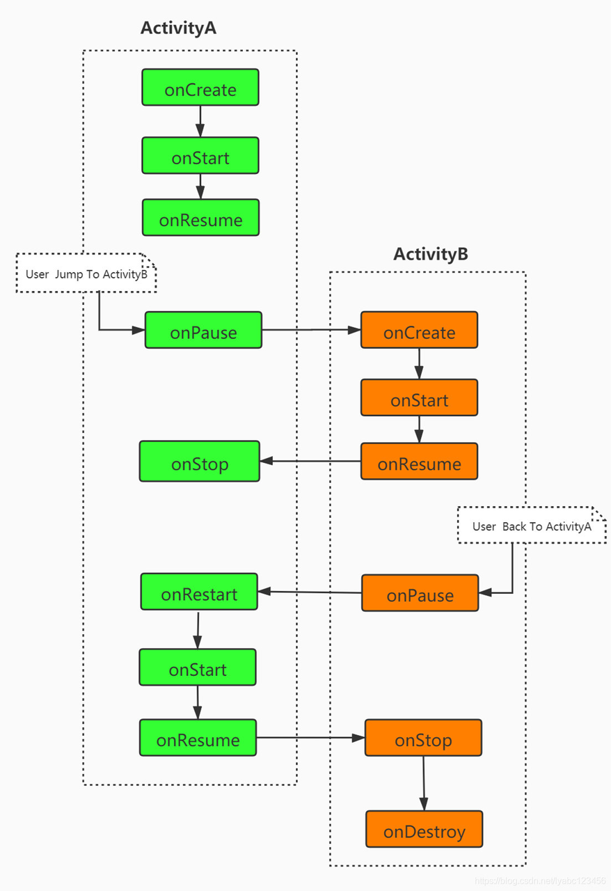

# day: 2.21
1. 学习了 kotlin语法中
    inline、noinline、crossinline 的概念作用
2. ViewModel
   - 学习了ViewModel的概念，具有长生命周期 及 在Activity旋转保持 数据不变的原理
     基本原理是：在Application的onCreate钩子函数调用时，调用startKoin创建ViewModel的BeanDefination工厂类。
     - （Activity、Fragment等）相关组件实现了ViewModelStoreOwner接口，在懒加载获取viewModel时，使用为ViewModelStoreOwner扩展的高级函数::viewModel<T>()，
       构建ViewModelProvider，
       - 通过provider的get(key,clazz)获取ViewModel实例；
         - 首先查看传入的vmStore中是否存在该key的viewModel，否则调用ViewModelProvider::factory的create方法，
           - 从koinContext的get方法中，instanceRegistry查找，然后将功能下发给beanRegistry->searchByClass()::
           - 通过definitions获取一个BeanDefination,而这个defination在koin的初始化时被添加至definations中；
           - 最终通过definitions::invoke(参数)创建
3. Application
      - BIND_APPLICATION消息=>handleBindApplication()
        -attachBaseContext经历的调用流程 ->LoadedApk::makeApplicationInner()-> Instrumentation::newApplication(classLoader,className, context)-> app.attach()->attachBaseContext()
        - onCreate经历的调用流程 -> Instrumentation::callApplicationOnCreate(app)->app.onCreate()
4. 在一个Activity中启动另一个Activity经历的生命周期，onCreate->onStart->onResume()
     
5. Activity的四种启动模式
        - Standard
        - SingleTop
        - SingleInstance
        - SingleTask
    - 处于不同启动模式下，发生跳转的生命周期变化，特别点在于SingleTop和SingleInstance onNewIntent()->onResume()
   
    
    
# day: 2.22 回溯了day21对于koin及ViewModel梳理回滚，RecycleView的布局（LayoutManager）和缓存（Recycler）   进行了一场面试
    面试中掌握不足的有 
     1. ANR 的概念，检测机制，线上发生ANR如何监控；
     2. 算法题： 根据前序遍历和后序遍历还原二叉树；
# day 2.23 先应付完工作， 在处理下算法题，之后看自定义View
    自定义View 构造函数中的第三个参数
        defStyleAttr: 首先我们构建了一个自定义style
            